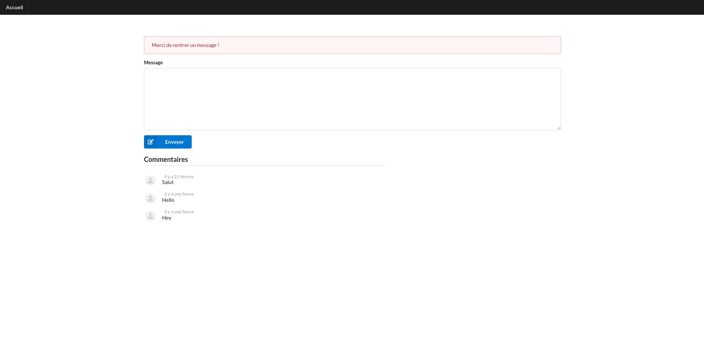

# Gestions des commentaires !

## Langages utilisés ?

+ HTML5, CSS3, ejs
+ JavaScript, expressjs, mysql

## Comment Lancer ?

`` npm i --save express$``{\n}
`` npm i --save mysql$``{\n}
`` npm i --save express-session``${\n}
`` npm i --save ejs``${\n}
`` npm i --save nodemon``${\n}

> Pour lancer : 'npm start'
> Puis rdv sur http://localhost:8000

## Screenshots :

